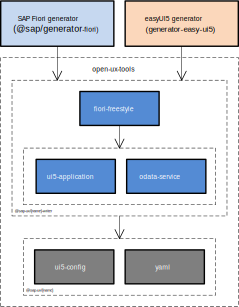

# Open UX Tools

[](https://api.reuse.software/info/github.com/SAP/open-ux-tools)

The Open UX tools project aims to provide open source modules that make the development of SAP Fiori applications more efficient. The project is maintained by the same team that is responsible for SAP Fiori tools (https://help.sap.com/viewer/product/SAP_FIORI_tools) and driven by the SAP community. The main goal of this project is to collaborate with the community to create transparency and therefore increase the adoption of our tools.

**Collaboration**: SAP has a great and active development community that is eager to help improve SAP products. With SAP Fiori tools, we have collaborated with stakeholders using roundtables, surveys, and usability testing. We have even collaborated using SAP's incident management systems, connecting with users that did not just report issues but also debugged and identified the root cause. With Open UX tools, we want to take this collaboration to the next level by empowering users to contribute findings, fixes, and improvements to the project.

**Transparency**: Anyone can inspect the sources, check for inconsistencies or problems, or get inspired to enhance the tools for the SAP Fiori community. Transparency matters to us. It builds trust in our tools and promotes more open communication.

**Adoption**: The first consumer of these modules is SAP Fiori tools but every module is designed to be reusable by anyone building any kind of tools to develop SAP Fiori applications. This may be other open source projects or very use case specific internal projects. With our initial set of modules, we want to enable generator/scaffolding projects to use building blocks to create a common project structure across the SAP ecosystem.

## Modules
Our long-term vision is to completely transition our SAP Fiori tools to open source. This is not an easy endeavor due to the size of the code base and dependencies to other not-yet-open-sourced modules. If you would like to better understand where we started and how we are planning to move forward, please have a look at our blog post [History and vision of the Open UX tools.](https://blogs.sap.com/2021/11/09/the-open-ux-tools-journey/).

As a starting point, we have extracted the templates for generating SAP Fiori freestyle applications. The templates have been dissected into small but easy to use building blocks that are simple to combine. The repository also contains reusable helper modules e.g. to modify UI5 tooling configuration files.

The image below gives an overview of the currently included modules and their dependencies. It also shows the known consumers of these modules, the SAP Fiori generator (`@sap/generator-fiori`) and the easyUI5 open source project (`generator-easy-ui5`).



The repository contains no private modules i.e. all modules are published to https://www.npmjs.com/search?q=%40sap-ux[npmjs.com] under the scope `@sap-ux`. The name of the published modules (without scope) matches the folder name in `packages` e.g. `./packages/fiori-freestyle-writer` is published as `@sap-ux/fiori-freestyle-writer`.

## Development Setup

### Install `pnpm` globally

To install `pnpm` globally using `npm`, run the following:
```shell
npm install -g pnpm
```

More information on pnpm installation options can be found [here](https://pnpm.io/installation).
### Install dependencies
To install `dependencies` and `devDependencies`, run following command at root of the repository:

```shell
pnpm install
```
### Build packages

To transpile the packages, run the following command at the root of the repository or in the individual package:

```shell
pnpm build
```

### Format sources using `prettier`

To format sources, run the following command at the root of the repository or in the individual package:

```shell
pnpm format
```

### Run linting of sources using `eslint`

To run linting of sources, run the following command at the root of the repository or in the individual package:

```shell
pnpm lint
```

To fix linting errors that can be fixed automatically, run the following command at the root of the repository or in the individual package:

```shell
pnpm lint:fix
```

### Run unit tests in packages

To run unit tests using `jest`, run the following command at the root of the repository or in the individual package:

```shell
pnpm test
```

### Create changesets for feature or bug fix branches

A [changeset](https://github.com/atlassian/changesets) workflow has been setup to version and publish packages to npmjs.com. To create changesets in a feature or bug fix branch, run one of the following commands:

```shell
pnpm cset
```

```shell
pnpm changeset
```

This command brings up an [inquirer.js](https://github.com/SBoudrias/Inquirer.js/) style command line interface with prompts to capture changed packages, bump versions (patch, minor or major) and a message to be included in the changelog files. The changeset configuration files in the `.changeset` folder at the root need to be committed and pushed to the branch. These files will be used in the GitHub Actions workflow to bump versions and publish the packages.

The general recommendation is to run this changeset command after a feature or bug fix is completed and before creating a pull request. 

A GitHub bot [changeset-bot](https://github.com/apps/changeset-bot) has been enabled that adds a comment to pull requests with changeset information from the branch and includes a warning when no changesets are found.

### Publish to npmjs.com

All modules are published under the `@sap-ux` scope. Publishing packages to npmjs.com is done on every merge commit made to the `main` branch. This is done in two steps in the GitHub Actions workflow:

1. The version job bumps versions of all packages for which changes are detected in the changeset configuration files and also updates changelog files. This job is run when a pull request branch is merged to the main branch and basically runs `changeset version` and commits and pushes the changes made to the `package.json`, changelog, and pnpm lock files.

2. The release job is configured to run after the version merge commit has been pushed to the main branch in the version job. This job publishes the changed packages to npmjs.com

### Licensing

Copyright (2021) SAP SE and `open-ux-tools` contributors. Please see our [LICENSE](./LICENSE) for copyright and license information. Detailed information including third-party components and their licensing/copyright information is available via the [REUSE tool](https://api.reuse.software/info/github.com/SAP/open-ux-tools).
