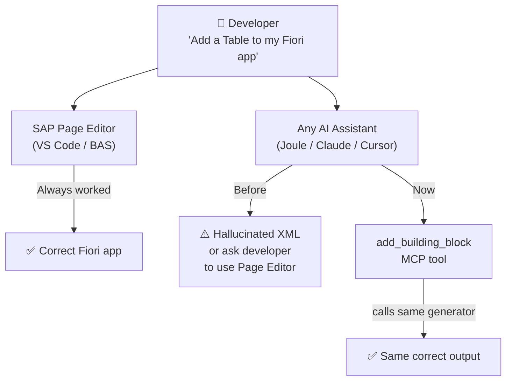
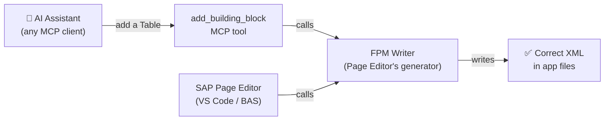

# Fiori Building Blocks via MCP

## Who This Is For

- **Claude Code / Cursor users** — developers using non-SAP AI tools who want Page Editor quality output without switching to BAS or VS Code with SAP extensions
- **Joule users** — before this tool, Joule had no reliable way to add building blocks either (other than adding skills); now it can add mcp server connector directly.
- **CI/CD pipelines** — teams that scaffold Fiori apps programmatically, where no GUI is available

---

## The Problem

Developers increasingly use AI assistants to build Fiori apps. Until now, the only reliable way to add a Fiori Elements building block was through the SAP Page Editor in VS Code or BAS. AI tools can write building block XML, but the output can be error-prone — it varies depending on app state and how the prompt is worded. This gives any AI assistant the same quality output as the Page Editor.

---

## How It Works

A new MCP tool — `add_building_block` — bridges any AI assistant to the SAP Page Editor's own generator. The developer asks their AI to add a building block; the tool handles the rest.

The tool calls FPM Writer -> It handles namespaces, manifest dependencies, and fragment files automatically. The AI decides what to add; FPM Writer ensures it's written correctly. Input is validated against a typed schema before the generator is called — malformed requests are rejected with a clear error before any files are touched.

---

## Validated

This was tested end-to-end with a real Fiori app in both Claude Code and Joule Desktop. FilterBar, Table, and Rich Text Editor all produced correct output on the first call — identical to what the Page Editor produces.

---

## Skill and Tool Together

The tool handles execution. But before calling it, the AI needs context — which annotations exist, what the routing looks like, where the correct insertion point is. A companion skill covers that preparation step.

The skill is the "before". The tool is the "do it". Together they give any AI assistant a complete, reliable workflow for adding building blocks — from prerequisites to correct output.

---

## Current Scope

The tool currently supports 12 building block types — Table, FilterBar, Chart, Form, Field, Page, Rich Text Editor, and custom column, filter, form field, button groups, and action. These cover the most commonly used types.

When a developer adds a new building block type to FPM Writer, they are also responsible for updating the MCP tool's schema in the same PR. A small CI test validates this — if the schema is not updated, the build fails before the change can be merged.

---

## Further Reading

For the full technical spec — tool input/output schema, files changed, validation results, and how the schema stays in sync with `fe-fpm-writer` — see [add-building-block-spec.md](add-building-block-spec.md).

---
