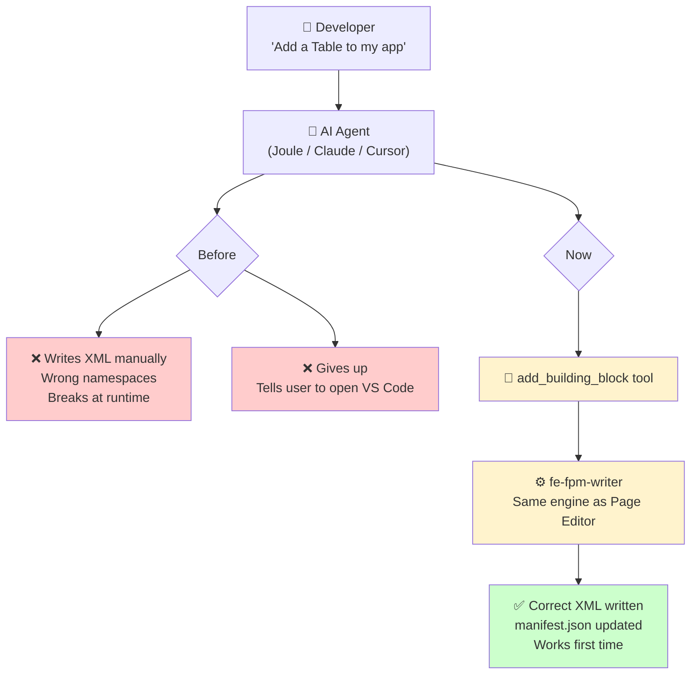

# Spec: `add_building_block` MCP Tool — POC

## Target Users

Any developer or agent working with SAP Fiori apps via an MCP-compatible client (Claude Code, Cursor, Joule Desktop) — whether building directly or automating as part of a higher-level agent workflow.

---

## Problem

Adding a SAP Fiori Elements Building Block to an existing app today requires:

1. Knowing the correct XML syntax and namespace for the target BB type
2. Manually constructing the `<macro:*>` element with the right attributes
3. Ensuring `sap.fe.macros` is declared in `manifest.json`
4. Knowing the correct `aggregationPath` XPath for the target view

This is error-prone and requires deep knowledge of the `sap.fe.macros` API. There was no way for an AI assistant (Joule Desktop, Claude Code, Cursor) to do this reliably through MCP.

Currently available in **SAP Business Application Studio** and **VS Code** only.

### Counterfactual — What happens without this tool

Without `add_building_block`, an agent faced with "add a Table building block" has two real options:

- **Direct XML authoring** — the agent writes `<macros:Table ...>` into the view file directly. This is fragile: hallucinated attributes, wrong namespaces, and missing `manifest.json` updates produce apps that break silently at runtime. The output cannot be trusted the way Page Editor output can.
- **Fail gracefully** — the agent tells the user to open VS Code or BAS and use the Page Editor GUI manually.

The existing `execute_functionality` 3-step workflow does not cover building blocks. The Page Editor GUI works but is locked to the SAP tooling ecosystem and is not automatable.

`add_building_block` closes both gaps: agents get correct-by-construction output in any MCP client, and the operation becomes automatable in CI/CD pipelines.

---

## Solution

Added an `add_building_block` tool to `@sap-ux/fiori-mcp-server` that calls `generateBuildingBlock()` from `@sap-ux/fe-fpm-writer` directly and exposes it as a structured MCP tool.

The LLM handles judgment (which BB type, which properties, what aggregation path). The tool handles deterministic execution (calling the generator, writing files, returning results).

**Validated**: Works end-to-end through both Claude Code and Joule Desktop (via supergateway SSE on port 9881).

---

## Use Cases

### 1. Adding analytics to an existing app
A developer has an FPM custom page and wants to add an analytical view. They ask the agent to add a Chart and FilterBar for a given entity — no need to open the Page Editor GUI or know the `sap.fe.macros` namespace.

### 2. Rapid prototyping
A developer scaffolding a new custom page asks the agent to wire up a Table, FilterBar, and RTE notes field in one go. The BBs are inserted correctly while the developer focuses on business logic.

### 3. Custom columns for business-specific display
A developer asks for a custom column showing delivery status. The generator automatically scaffolds the fragment file, sets up the correct namespace, and names the fragment correctly — work that would otherwise require knowing the Page Editor's file naming and namespace conventions.

### 4. Working outside VS Code / BAS
A developer using Cursor, Claude Code, or any future MCP-compatible client gets the same Page Editor quality output without needing SAP tooling installed. This is a concrete differentiator — BB authoring is no longer locked to the SAP ecosystem.

### 5. Onboarding new developers
A developer new to Fiori Elements doesn't know `sap.fe.macros` namespaces or annotation paths. They describe what they want in natural language and the tool handles the technical details correctly.

### 6. CI/CD and scripted app setup
An automated pipeline can scaffold a standard set of BBs into a new app as part of project initialisation:
1. Generate the app via `generate_fiori_app_odata`
2. Call `add_building_block` multiple times to wire up Table, FilterBar, Chart
3. Commit the result

Today this is not possible without either running the Page Editor GUI manually (not automatable) or writing raw XML (fragile, breaks with UI5 version changes). `add_building_block` closes that gap and positions the MCP server as pipeline infrastructure, not just a developer convenience.

---


Before this tool existed, adding a Building Block to a Fiori app required either:
- The **SAP Page Editor GUI** in VS Code or SAP Business Application Studio (BAS) — works, but locked to the SAP tooling ecosystem
- **Manual XML authoring** — requires deep knowledge of `sap.fe.macros` namespaces and annotation paths

An AI assistant could attempt to write the XML directly, but this is unreliable:
- Hallucinated attributes or incorrect namespace declarations produce markup that breaks at runtime
- `manifest.json` also needs updating to declare `sap.fe.macros` as a dependency — easy to miss
- Output cannot be trusted the same way Page Editor output can

`add_building_block` closes that gap:

- **Correct by construction** — uses the same `fe-fpm-writer` generator as the Page Editor, so the output is identical to what a developer would get from the GUI
- **Handles file routing automatically** — `generateBuildingBlock()` knows which file to update based on where the BB is inserted: `view.xml` for custom pages, `fragment.xml` for custom sections. It also adds `sap.fe.macros` to `manifest.json` dependencies if not already declared. The agent does not need to reason about any of this.
- **Any MCP-compatible client** (Joule Desktop, Cursor, Claude Code) can now add a Building Block reliably via natural language — no VS Code, no BAS, no GUI navigation required
- **Protocol-level reach** — works wherever MCP is supported, today and in future clients

---


When a developer says *"add a Table building block to my main view"*, the agent:

1. Calls `list_fiori_apps` to find the app path
2. Reads the view XML to find a valid `aggregationPath`
3. Optionally calls `search_docs` to determine which `metaPath` annotation a Table needs (e.g. `@com.sap.vocabularies.UI.v1.LineItem`)
4. Calls `add_building_block` with all params filled in

The agent handles **judgment** — which annotation, which path, which type. The tool handles **execution** — calling the generator, writing files, returning results. This division is why the tool description and parameter names matter: they are what the agent reads to reason correctly.

---

## How It Works



---

## Tool Definition

### Name
`add_building_block`

### Description
Adds a SAP Fiori Elements Building Block (Table, Chart, FilterBar, Field, Form, etc.) to an existing view or fragment XML file in a Fiori app. Calls `@sap-ux/fe-fpm-writer` `generateBuildingBlock()` and writes the result to disk.

### Input Schema

`buildingBlockData` is a **discriminated union** on `buildingBlockType` — the valid fields depend on which type is chosen. All types share a base set of fields, with additional fields per type.

**Shared base fields (all types):**

| Field | Required | Description |
|-------|----------|-------------|
| `buildingBlockType` | ✅ | One of the supported types (see below) |
| `id` | ✅ | ID for the inserted XML element |
| `metaPath` | — | Annotation path, e.g. `@com.sap.vocabularies.UI.v1.LineItem` |
| `contextPath` | — | Entity set path, e.g. `/SalesOrder` |

**Supported types and their additional fields:**

| `buildingBlockType` | Key extra fields |
|---------------------|-----------------|
| `table` | `filterBar`, `personalization`, `selectionMode`, `type`, `header`, `enableExport`, `readOnly` |
| `chart` | `filterBar`, `personalization`, `selectionMode`, `selectionChange` |
| `filter-bar` | `liveMode`, `showClearButton`, `showMessages`, `filterChanged`, `search` |
| `field` | `readOnly`, `semanticObject` |
| `form` | `title` |
| `page` | `title`, `description`, `templateType` |
| `rich-text-editor` | `targetProperty` |
| `rich-text-editor-button-groups` | _(base fields only)_ |
| `custom-filter-field` | `anchor` ✅, `label` ✅, `property` ✅, `required` ✅, `filterFieldKey` |
| `custom-form-field` | `label` ✅, `targetProperty` |
| `custom-column` | `title` ✅, `width`, `columnKey` |
| `action` | `actionKey` ✅, `text` ✅, `anchor`, `placement`, `requiresSelection` |

**Outer fields:**

| Field | Required | Description |
|-------|----------|-------------|
| `appPath` | ✅ | Absolute path to the Fiori app root (where `manifest.json` lives) |
| `viewOrFragmentPath` | ✅ | Relative path to the target view or fragment XML file |
| `aggregationPath` | ✅ | XPath to the aggregation element where the BB will be inserted |
```

### Output Schema

```typescript
{
  status: 'success' | 'error';
  modifiedFiles: string[];       // Relative paths of files written
  message: string;               // Human-readable result or error description
}
```

---

## Files Changed

| File | Change |
|------|--------|
| `package.json` | Added `@sap-ux/fe-fpm-writer: workspace:*` to `dependencies` (not `devDependencies` — must be external to preserve runtime `__dirname` template resolution); added to esbuild `external` list in `scripts/bundle.mjs` |
| `src/tools/add-building-block.ts` | New — core implementation |
| `src/types/input.ts` | Added `AddBuildingBlockInputSchema` |
| `src/types/output.ts` | Added `AddBuildingBlockOutputSchema` |
| `src/types/index.ts` | Exported `AddBuildingBlockInput` / `AddBuildingBlockOutput` types |
| `src/tools/index.ts` | Exported `addBuildingBlock`, added tool definition to `tools` array |
| `src/server.ts` | Added import, `ToolArgs` union, `case 'add_building_block':` handler |
| `test/__mocks__/@sap-ux/fe-fpm-writer.cjs` | Added `generateBuildingBlock` and `createIdGenerator` stubs |
| `test/unit/server.test.ts` | Updated tool list and error message assertions |
| `test/unit/tools/add-building-block.test.ts` | New — unit tests for `addBuildingBlock` (8 cases, 100% coverage) |

---

## Validation

### POC Acceptance Criteria — All Passed ✅

1. Claude Code: "Use the `add_building_block` tool to add a Table building block..." → tool called, view XML updated
2. Joule Desktop (via supergateway SSE): same prompt → `tools/call` logged, `status: 'success'` returned, file written to disk
3. `generateBuildingBlock()` executes without error
4. View XML updated with correct `<macros:Table>` element and attributes
5. Tool returns list of modified files

### Test app used
`/path/to/your/fiori-app` — OData V4 FPM app with a `CampaignsToProductsRelations` entity set.

### Example prompt

Used in Joule Desktop to validate all three BB types in a single agent run:

```
I am working on a Fiori FPM app at /path/to/your/fiori-app

Add the following building blocks to the main custom page view.
Read webapp/manifest.json first to find the correct view/fragment files,
then read those files to determine the correct aggregationPath before
calling add_building_block. Do NOT write any XML manually.

1. A FilterBar with id productFilterBar,
   contextPath /CampaignsToProductsRelations

2. A Table with id productTable,
   contextPath /CampaignsToProductsRelations,
   linked to productFilterBar

3. A Rich Text Editor with id productNotesRte,
   targetProperty /CampaignsToProductsRelations/description
```

**Results:**
- FilterBar ✅ — inserted with correct `<macros:FilterBar>` element
- Table ✅ — inserted with `filterBar="productFilterBar"` attribute
- RTE ⚠️ — inserted but with `metaPath=""` (root cause: `fe-fpm-writer` template uses `metaPath` not `targetProperty`; fixed by `applyRteMetaPath()` in `add-building-block.ts`)

---

## Known Limitations (PR-blockers)

1. **No changeset entry** — required by open-ux-tools contribution process
2. **Direct `fe-fpm-writer` dependency** — bypasses `ux-specification` abstraction layer; proper path would extend `ux-specification` to support BBs, but that is a larger cross-package change

---

## Joule Desktop Integration

Run the server locally via:
```bash
cd packages/fiori-mcp-server
npm run start
# Starts supergateway SSE on http://localhost:9881/sse
```

Add `http://localhost:9881/sse` as an SSE MCP server in Joule Desktop settings.

---

## Out of Scope (POC)

- Adding building blocks to CAP projects
- `get_bb_state` integration
- Extending `@sap/ux-specification` to support BBs natively
