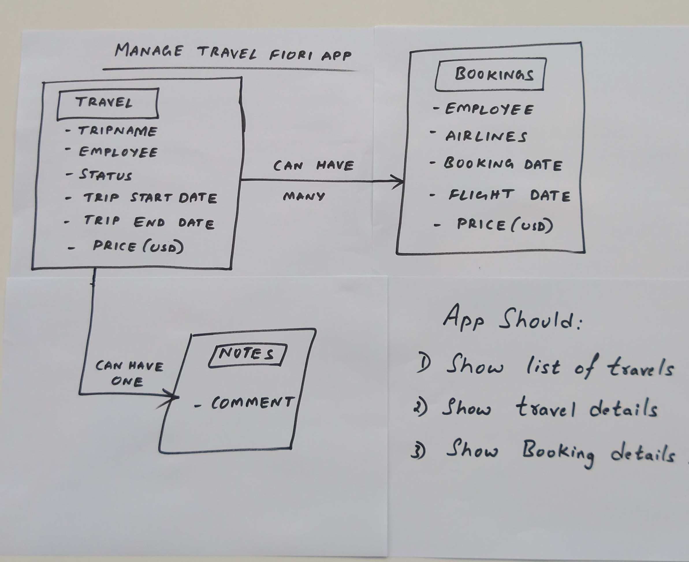
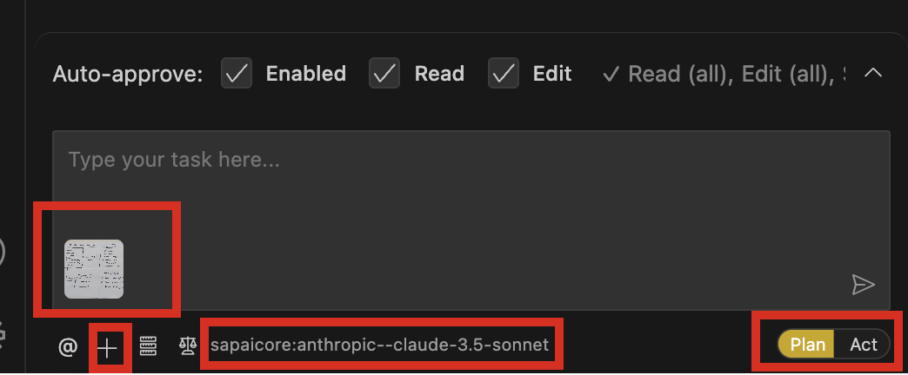
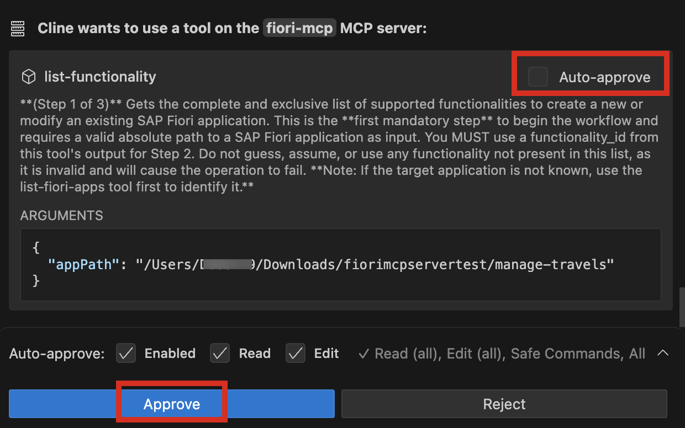
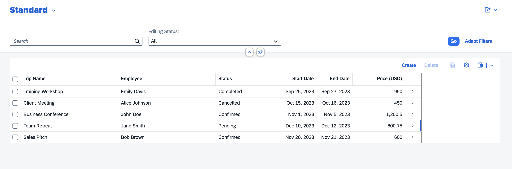
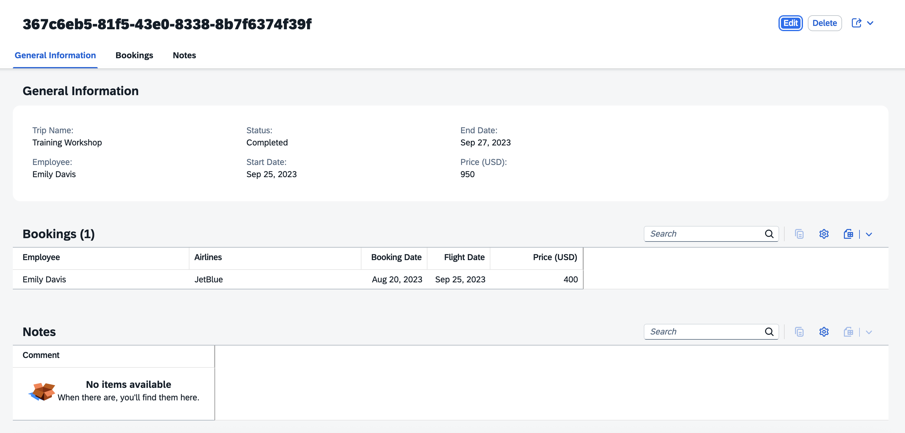

# Manual Test Case: Generate Fiori App using Fiori MCP Server

## Prerequisite

1. [Install and Configure CLine extension](./setup_cline.md)

2. [Install and Configure fiori mcp server](./setup_fioriMcpServer.md)

3. [Install and Configure cds mcp server](./setup_cdsMcpServer.md)

4. In VS code workspace, clone repo [CAP project](https://github.com/vinayhospete/manage-travels/)

## Test Steps

## Generate fiori app in an existing CAP project (manage-travels) using an image.

1. Open Cline, select AI model. let's choose `claude-3.5-sonnet`
2. Select Plan mode and Upload below image 
   
   
3. Run the task.
4. Cline responds back with following plan 

```
Based on the analysis of the existing CAP project structure, we have a solid foundation for creating the Manage Travel Fiori app as described in the image. Here's the plan to implement the application:

1. Verify and update the data model:

   - The current data model in schema.cds closely matches the requirements shown in the image.
   - We'll review and make any minor adjustments if needed.

2. Check and update sample data:

   - Ensure the CSV files in the test/data folder contain appropriate sample data for Travels, Bookings, and Notes.
   - Update or add data if necessary to showcase all features of the application.

3. Create the Fiori elements application:

   - We'll use the Fiori MCP server to generate the Fiori elements application based on the existing CAP service.
   - This will create the necessary UI annotations and configurations.

4. Configure the application:

   - Implement the List Report page to show the list of travels.
   - Set up the Object Page to display travel details.
   - Configure a section in the Object Page to show related booking details.
   - Ensure that notes can be added to travels.

5. Test the application:

   - Run the application locally to verify all functionalities.
   - Test the list view, travel details view, and booking details view.
   - Verify that all required fields are displayed and editable as needed.

Do you want to proceed with this plan, or would you like to make any modifications?

```

5. Enter "proceed with this plan without any modifications"
6. Toggle to Act Mode.
7. Cline starts fiori app generation.
8. During generation cline requests for approval to use tools (Fiori mcp and cds mcp). select Auto- Approve.
   
9. When cline requests approval for `execute-functionality` make sure the generation input matches below json format
```
{
  "appPath": "/Users/I12345/Downloads/fiorimcpservertest/manage-travels",
  "functionalityId": "generate-fiori-ui-app",
  "parameters": {
    "appGenConfig": {
      "app": {
        "id": "manage-travels-app",
        "title": "Manage Travels",
        "description": "Fiori application for managing travels and bookings",
        "sourceTemplate": {
          "id": "ui5template.fiorielements.v4.lrop",
          "version": "1.0.0"
        }
      },
      "dataSource": {
        "mainService": {
          "uri": "/odata/v4/manage-travel-srv/",
          "type": "OData",
          "settings": {
            "odataVersion": "4.0"
          }
        }
      },
      "mainEntity": "Travels",
      "navigation": {
        "Travels": {
          "detail": {
            "route": "TravelsObjectPage"
          }
        }
      },
      "fiori": {
        "registrationIds": [],
        "archeType": "transactional"
      }
    }
  }
}
```
10.  Once the generation complete, Application preview opens up in the browser.
11.  Verify list report and object page.




