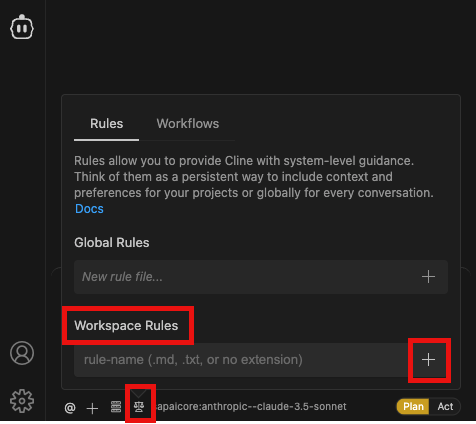

## Install and Configure CDS MCP Server

1. Open terminal, Install Fiori MCP Server
    - execute `npm i -g @cap-js/mcp-server`

2. In Cline, Open configure mcp server configuration. 


3. Add `cds-mcp` in cline_mcp_settings.json
    ```
    {
      "mcpServers": {
        ...
        ...
        ...
        "cds-mcp": {
          "command": "cds-mcp",
          "args": [],
          "env": {}
        }
      }
    }
    ```

4. Add Rules for Fiori MCP servers.


5. Enter rule-name (for ex: cdsmcp) under workspace rules and click on + icon. 

6. In cdsmcp.md file, Copy and paste rules from https://github.com/cap-js/mcp-server?tab=readme-ov-file#usage