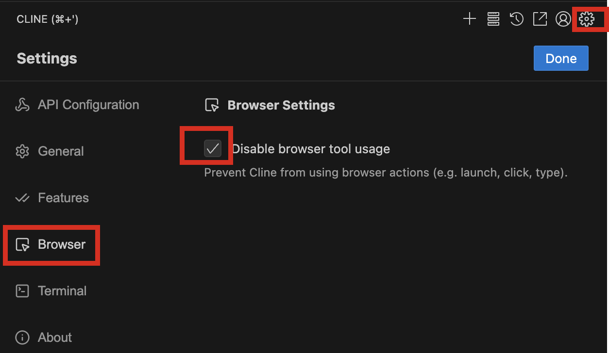

## Install and Configure Cline Extension on Vscode

## Installation

1. Open VS Code
2. Go to the Extensions tab**  
   - Press `Ctrl+Shift+X` on Windows or `Cmd+Shift+X` on Mac.
3. Search for “Cline”.**
4. Select the Cline extension from the results.**
5. **Click Install** and restart VS Code if necessary.

   

## Configuration

1. Open the Cline extension settings.**
2. Select SAP AI Core as your API provider.**
3. Enter your SAP AI Core authentication details:**
   - Client ID
   - Client Secret
   - Base URL (e.g., `https://api.ai.internalprod.eu-central-1.aws.ml.hana.ondemand.com`)
   - Auth URL (e.g., `https://fiori-tools-ai.authentication.sap.hana.ondemand.com`)
   - Resource Group
4. Choose your preferred AI model from the available options.**

5. Disable browser tool usage.
 

6. Configure Auto approve settings.
 