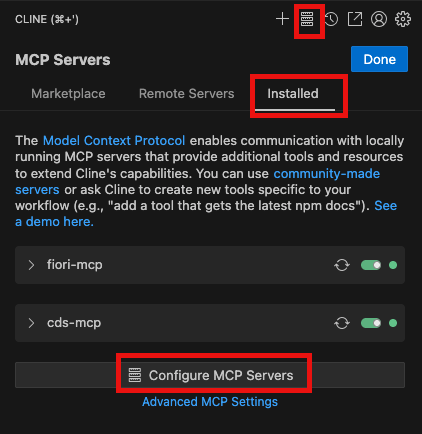

## Install and Configure Fiori MCP Server

1. Open terminal, Install Fiori MCP Server
    - execute `npm install -g @sap-ux/fiori-mcp-server`

2. Open configure mcp server configuration in cline.


3. Add `fiori-mcp` in cline_mcp_settings.json
```
{
  "mcpServers": {
    ...
    ...
    ...
    "fiori-mcp": {
      "type": "stdio",
      "command": "fiori-mcp",
      "args": []
    }
  }
}
```

4. Add Rules for Fiori MCP servers.


5. Enter rule-name (for ex: fiorimcp) under workspace rules. click on + icon. 
6. In fiorimcp.md file, Copy and paste rules from https://github.com/SAP/open-ux-tools/tree/main/packages/fiori-mcp-server#rules
   
  